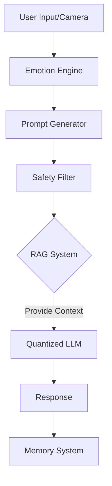

# 🧠 Emotion Recognition LLM for Raspberry Pi
## Child-Friendly AI Companion for AI Mirror Project


> [!NOTE]
> **Project Goal**: A complete, production-ready pipeline for building, training, and deploying an emotion-aware, offline LLM optimized for Raspberry Pi 5. Designed specifically for children aged 5-16 with comprehensive safety features and ethical guidelines.

---

## 🎯 Project Overview

### Purpose
Create an AI companion for an **Emotion Recognition AI Mirror** that:
- ✅ Recognizes facial expressions and emotional context
- ✅ Understands age-appropriate conversation
- ✅ Responds with safe, friendly, educational answers
- ✅ Operates **100% offline** on Raspberry Pi
- ✅ Includes comprehensive safety filters
- ✅ Respects privacy with local-only data storage

### Key Features
| Feature | Description |
|---------|-------------|
| **🎭 Emotion-Aware** | Adapts responses based on detected emotions (happy, sad, angry, etc.) |
| **👶 Age-Appropriate** | Adjusts language complexity for ages 5-16 |
| **🛡️ Safety-First** | Multi-layer content filtering and moderation |
| **🔒 Privacy** | All data stored locally, no cloud dependencies |
| **🧠 Memory System** | Ethical, consent-based conversation context |
| **⚡ Optimized** | Runs efficiently on Raspberry Pi 5 (4GB/8GB) |

---

## 📂 Repository Structure

The project is organized as follows:

```
llmemo/
├── 📁 src/                        # Core application logic
│   ├── run_ai_mirror.py          # Main entry point
│   ├── inference_engine.py       # LLM inference wrapper
│   ├── memory_manager.py         # Context & Memory
│   └── safety_filter.py          # Content moderation
├── 📁 docs/                       # Documentation & Guides
│   ├── HOW_TO_RUN.md             # Running instructions
│   ├── DEPLOY_RASPBERRY_PI.md    # Pi setup guide
│   └── ...
├── 📁 scripts/                    # Utility scripts
│   ├── train_lora.py             # Training pipeline
│   ├── quantize_model.py         # Model optimization
│   └── build_knowledge_base.py   # RAG data generation
├── 📁 data/                       # Datasets & Memory files
├── 📁 knowledge_base/             # RAG content
└── requirements_training.txt      # Dependencies
```

---

## 🚀 Quick Start

> [!IMPORTANT]
> **Prerequisites**: Raspberry Pi 5 (8GB recommended) or PC with GPU for training.

### 1. Installation
```bash
# Clone the repo
git clone https://github.com/NotShubham1112/ai-mirror.git
cd ai-mirror

# Install dependencies
pip install -r requirements_training.txt
```

### 2. Run the System
To start the full AI Mirror system on your machine or Raspberry Pi:

```bash
python src/run_ai_mirror.py
```

For detailed setup, see [**HOW_TO_RUN.md**](docs/HOW_TO_RUN.md).

---

## 🏗️ System Architecture



---

## 📖 Documentation

*   [**Deployment Guide**](docs/deploy_raspberry_pi.md): How to set up your Raspberry Pi.
*   [**Training Guide**](docs/train_lora.py): How to fine-tune your own model.
*   [**Ethical Guidelines**](docs/ethical_guidelines.md): Safety and privacy standards.
*   [**RAG Architecture**](docs/RAG_ARCHITECTURE.md): How the knowledge base works.

---

## 🛡️ Safety & Ethics

This project prioritizes **Safety by Design**:
1.  **Filter**: Blocks inappropriate content *before* it reaches the LLM.
2.  **Validate**: Checks the LLM's output before showing it to the user.
3.  **Privacy**: No data leaves the device.

---

## 🤝 Contributing
Contributions are welcome! Please open an issue or pull request.

## 📄 License
This project is open-source under the [MIT License](LICENSE). Copyright &copy; 2026 Shubham Kambli.

---

## 👨‍💻 About the Creator

**Shubham Kambli** (He/Him)  
*Founder @x_conquestx | Building AI, Quant & Open-Source Products*

Turning Research into Real Systems.  
CSE @ B.Tech | Mumbai, Maharashtra, India 🇮🇳

> "I build systems that bridge the gap between theoretical AI and practical, edge-deployed reality."

[**Contact / Follow**](#) &bull; [**GitHub**](https://github.com/NotShubham1112)

